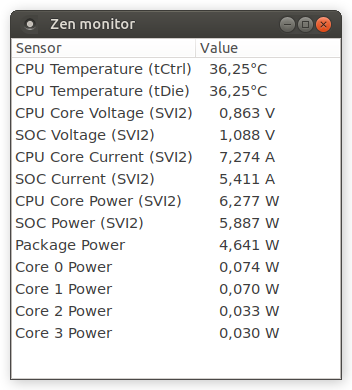

# Zen monitor
Zen monitor is monitoring software for AMD Zen-based CPUs.

It can monitor these values:
 - CPU Temperature
 - CPU Core (SVI2) Voltage, Current and Power
 - SOC (SVI2) Voltage, Current and Power
 - Package and Core Power



## Dependencies
 - [zenpower driver](https://github.com/ocerman/zenpower/) - For monitoring CPU temperature and SVI2 sensors
 - MSR driver - For monitoring Package/Core Power

Follow [zenpower README.md](https://github.com/ocerman/zenpower/blob/master/README.md) to install and activate zenpower module.
Enter `sudo modprobe msr` to enable MSR driver.

## Building 
Make sure that GTK3 dev package and common build tools are installed.
```
make
```

## Running
```
sudo ./zenpower
```

## Setup on ubuntu
First follow [installation instructions on zenpower](https://github.com/ocerman/zenpower/blob/master/README.md#installation-commands-for-ubuntu)
Then:
```
sudo modprobe msr
sudo bash -c 'echo "msr" > /etc/modules-load.d/msr.conf'
sudo apt install build-essential libgtk-3-dev git
cd ~
git clone https://github.com/ocerman/zenmonitor
cd zenmonitor
make
sudo ./zenmonitor
```
